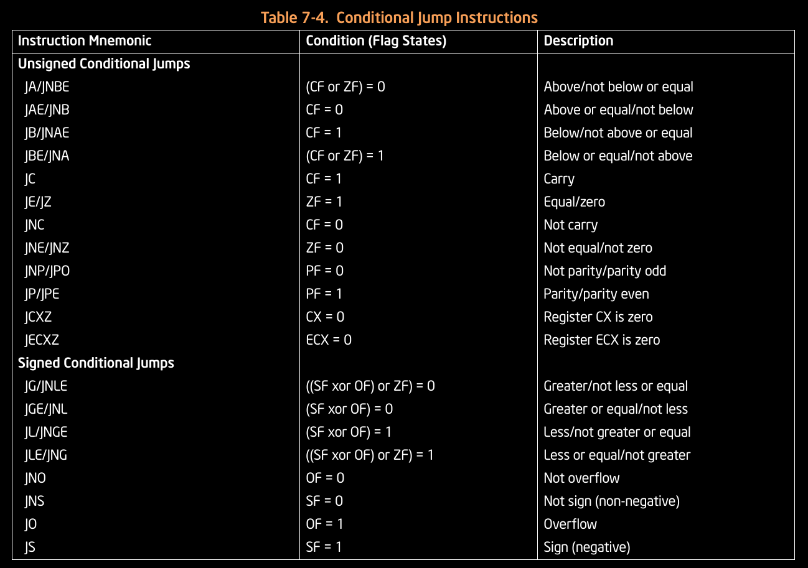

# Assembly Shenanigans

My attempt to teach others about microprocessors and programming in IA-32 and IA-64 assembly, and to spread the word of how awesome it is.

# Table of contents

- [Pre-requisites](#pre-requisites)
	- [Architecture Model](#architecture-model)
	- [ CPU ](#cpu)
	- [Registers](#registers)
	- [Bus](#bus)
	- [Clock Speed](#clock-speed)
	- [Fetch-decode-execute cycle](#fetch-decode-execute-cycle)
	- [Memory addressing ](#memory-addressing)
	- [Instructions](#instructions)
	- [Instruction Set Architecture](#instruction-set-architecture)
		- [Basics](#basics)
		- [Approaches to ISA on the basis of architectural complexity](#approaches-to-isa-on-the-basis-of-architectural-complexity)
		- [Microarchitecture](#microarchitecture)
		- [What does 32 and 64 bit actually mean?](#what-does-32-bit-and-64-bit-etc-actually-mean)
	- [Micro-processor, micro-controller, and micro-computer](#micro-processor%2C-micro-controller%2C-and-micro-computer)
	- [Difference b/w CPU, Processor and Core](#difference-b%2Fw-cpu%2C-processor-and-core)
- [x86_64 Assembly](#x86_64-assembly)
	- [Getting started](#getting-started)
		- [Installation](#installing-the-required-tools)
		- [Understanding process memory maps](#understanding-how-does-a-program-looks-like-in-the-memory)
		- [Looking at memory maps](#looking-at-the-process-memory-map)
		- [The boilerplate code](#the-boilerplate-code)
		- [Compiling and running our code](#compiling-and-running-the-code)
	- [Basics](#basics-of-assembly)
		- [Fundamental Data Types](#fundamental-data-types)
		- [Declaring initialized data](#declaring-initialized-data)
		- [Declaring uninitialized data](#declaring-un-initialized-data)
	- [The instruction set](#the-instruction-set)
		- [Moving data around](#moving-data-around)
		- [Arithmetic operations](#arithmetic-operations)
		- [Logical operations](#logical-operations)
	- [More advanced concepts](#more-advanced-concepts)
		- [Loops](#loops)
		- [Jumps](#jumps)
		- [Procedures](#procedures)
			- [Basics](#understanding-procedures)
			- [Anatomy of a CALL instruction](#anatomy-of-a-call-instruction)
			- [Anatomy of a RET instruction](#anatomy-of-a-ret-instruction)
			- [Stack Frames](#stack-frames)

# Pre-requisites

## Architecture model

The core elements of today's modern computing devices are consistent with those designed in the dawning phase of technology. So it's always good to study them beforehand, before moving onto its complex counterparts.

Architecture model | Description
-|-
Von Neumann | According to this architecture model, data and memory addresses in the same memory (you'll come to understand more about this later, the distinction is important in the case of [shellcoding](https://en.wikipedia.org/wiki/Shellcode)).
Harvard Architecture | According to this model, the data and the address are stored in different places


## CPU

A CPU has many internal components which we will discuss about, one by one; namely: Control Unit, Arithmetic Logic Unit (ALU), Registers, Cache, and Buses.


Name | Description
-|-
Control Unit | <li>It acts as a supervisor for different components of the CPU.</li><li>Controls the fetch-decode-execute cycle</li>
Arithmetic Logic Unit (ALU) | <li>Consists of **Arithmetic Unit** and **Logic Unit**</li><li>The arithmetic unit is responsible for performing mathematical operations (addition, subtraction and the likes)</li><li>The Logic Unit is responsible for the logical operations (XOR, AND, OR etc)</li>
Registers | <li>The smallest data holding elements that are build into the CPU and are directly accessible without any performance penalty</li><li>They're used to store instructions and values in the CPU that help execute the instructions without having to refer back to the main memory which is an expensive operation</li><li>Their storage capacity is limited in nature, which depends on the architecture, for example, registers are 64-bit in size in the case of `amd64`, and they're also limited in number</li>
CPU Clock | Speaking from the low level perspective, the CPU is just another creation of sequential and combinational logic. We need a clock to synchronize the internal circuitry. The clock does the job, by sending electric pulses at regular intervals, which is able to dictate how fast the CPU is able to execute its internal logic.
Cache | <li>They were designed, because without them, a microprocessor would have to sit idle for many cycles until the required data could come into the registers from the main memory.</li><li>They're built into the processor, and used to proactively store data pulled from the memory to enable fast access</li><li>**Cache Coherency**: A concept related to multi-threading/ multi-processing environments, where more than one entity might be looking at certain information. When that information is updated, it must be updated across all the places it’s stored at, be it the cache, the registers, RAM etc, otherwise problems will occur if obsolete data is in place.</li>


## Registers

The number of possible registers depends from architecture to architecture, but they can be categorized into:

Name | Description
-|-
Accumulator | The most frequently used register, sometimes built into the ALU, used to store intermediary data when logical/ arithmetic calculations are being done
Instruction register | Holds the instruction which is just about to be executed by the processor.
Program Counter (Instruction Pointer) | Used to keep track of the execution, and points to the next instruction which needs to be executed after the current one
Counters | Used in loops
Stack/ Base Pointer | Used to point to the top and base of the stack respectively, extremely important to understand the concept of _Stack Frames_.
FLAGS | A register in which each bit is independent of one another, and stores information about the current status at any given stage of program execution.
Additional registers | Depends on the architecture, and they're extensions to the basic set of registers, such as x87, MMX, SSE etc.

In the case of x86_64, general purpose registers are 64-bits in size.
- The lower 32-bits of `RAX`, `RBX`, `RCX`, `RDX` can be accessed via `EAX`, `EBX`, `ECX`, and `EDX`, their lower 16-bits by `AX`, `BX`, `CX` and `DX`. The lower half of the said 16-bits by `AL`, `BL`, `CL`, `DL` and the upper half by `AH`, `BH`, `CH` and `DH`.
- GPR `RSI`, `RDI`, `RBP` and `RSP` are 64-bits in size, and their lower 32-bits can be accessed by `ESI`, `EDI`, `EBP`, `ESP`, and their lower 16-bits can be accessed by `SI`, `DI`, `BP`, `SP` and their lower 8- bits can be accessed by `SIL`, `DIL`,  `BPL` and `SPL`.
- There are other 8 GPR, named from `R8` - `R15`. The whole 64-bits can be accessed via `R8`, the lower 32-bits via `R8D` (double word), the lower 16-bits via `R8W` (R8-word), and further lower 8-bits via `R8B` (R8-byte)
- Due to various design decisions made during the design of x86_64, accessing EAX would wipe out the upper 32-bits of the RAX register (and all other GPRs)

```
 General purpose registers: 64 bit                        RSI, RDI, RSP, RBP
 RAX, RBX, RCX, RDX                              R8, R9, R10, R11, R12, R13, R14, R15


┌──────────────────RAX──────────────────┐      ┌─────────────RSI/R8────────────────────┐
┌───────────────────┬─────────┬────┬────┐      ┌───────────────────┬─────────┬────┬────┐
│                   │         │    │    │      │                   │         │    │SIL │
│                   │         │AH  │AL  │      │                   │         │    │R8B │
└───────────────────┴─────────┴────┴────┘      └───────────────────┴─────────┴────┴────┘
                              └───AX────┘                                    └─SI/R8W──┘
                    └───────EAX─────────┘                          └────ESI/R8D────────┘
```

## Bus

- A bus is a group of wires having common functionality, and they're used to interconnect stuff internally within the CPU.
- Some higher end systems use switch instead of the bus-based architecture but that's outside the scope of this post.

Name | Description
-|-
Control Bus | Bi-directional in nature (CPU <---> other parts), and are used to control the data flow. Control signals are transferred through this bus, and they synchronize everything connected to the data bus.
Address Bus | <li>Unidirectional in nature (CPU ---> other parts), and are used to transfer addresses from the microprocessor to the other components. Memory addresses are transferred through this lines.</li><li>Used to define the amount of addressable memory by the microprocessor, say if there are 16-address lines (like that in Intel 8085), $$2^{16}$$ memory addresses can be addressed by the microprocessor, and $$2^{16}$$ bytes of memory if we consider it to be byte-addressable.</li>
Data Bus    | <li>They are used for data transmission b/w the micro-processor and other peripherals, and within the microprocessor as well</li><li>They're bidirectional in nature and are used to define the native word size</li>

## Clock Speed

The CPU works on the basis Fetch-Decode-Execute cycle, the clock rate of a CPU, is the number of times this cycle occurs per second. It’s often used as an indication of processor's speed.


## Fetch Decode Execute Cycle

- Most of the modern day CPUs support _stored program execution_, which means the instructions to be executed will firstly exist in the memory, which will later be fetched into the registers, decoded and executed. This process is known as **Fetch Decode Execute**.
- The Control Unit drives the fetch, decode, execute and store functions of the processor

```
initialise the program counter
repeat forever
	fetch instruction
	increment the program counter
	decode the instruction
	execute the instruction
end repeat

              ┌────────────┐
       ┌──────►Control Unit├────┐
       │      └────────────┘    │Execute
Decode │                        │
    ┌──┴──────┐               ┌─▼─┐
    │Registers◄───────────────┤ALU│
    └─────────┘   Fetch       └───┘
```

Step | Description
-|-
Fetch | <li>The CPU fetches instructions from the physical memory using their memory addresses (mentioned in Program Counter/ Instruction Pointer), which is then stored in the Instruction Register.</li><li>Before the instruction is fetched, the Control Unit generates and sends out a control signal (Memory Read) to the primary memory to let it know it’s about to get accessed, then the the instruction is fetched through the  data lines.</li>
Decode | <li>The CPU interprets the binary instruction to determine what task it’s supposed to perform and transfers the data needed to the registers to prepare to execute the specific instruction</li><li>Instructions are formatted in a particular way to enable efficient decoding, and it specifies opcode (operations to be performed) and operands (what to perform the operations on), and also the addressing mode.</li><li>Decoder circuity is used here (such as 8 to 256 line decoder and all)</li>
Execute | <li>At this stage, binary instruction is decoded and one of the output lines is applied, to perform the task in hand, whatever it may be.</li><li>After execution of an instruction is done, the instruction pointer (Program Counter) now points to a new location where the next instruction will be stored and this cycle repeats again.</li>


## Memory Addressing

```
The number and order of operands depends on the instruction addressing mode as follows:
Addressing Modes

Register Direct: Both the operands are registers
ADD EAX, EAX

Register Indirect:Both the operands are registers, but contains the address where the operands are stored in memory
MOV ECX, [EBX]

Immediate: The operand is included immediately after the instruction in memory
ADD EAX, 10

Indexed: The address is calculated using a base address plus an index, which can be another register
MOV A, [ESI+0x4010000]
MOV EAX, [EBX+EDI]
```

## Instructions 

Name | Description
-|-
Mnemonics | <li>These are the mappings for the binary machines codes so as to enable faster writing, and debugging of code. </li><li>We need an assembler to convert assembly (mnemonics) code to native format</li><li>The mappings are defined by the ISA, such as in the 8085 architecture, A register is the mapping for 111, and ADD is the mapping for 10000, when we assemble our code for say ADD A it would get translated to (10000)(111)</li>
Machine code | They can be understood by the micro-processor directly w/o any need of middle man.


## Instruction Set Architecture

### Basics

- Instructions are defined as per a specification, which is known as the Instruction Set Architecture (ISA). It's specifies things such as type and size of operands, register states, memory model, how interrupts and exceptions are handled etc viz. it's the syntax and semantics.
- Some examples are: x86, x86_64, ARM, MIPS, Power PC, RISC-V etc

### Approaches to ISA on the basis of architectural complexity

Name | Description
-|-
Complex Instruction Sets | <li>More work is done in a single instruction (capable of multi-step operations), and takes as much time as it needs for execution.</li><li>Many instructions are supported</li><li>A computer built with this set is known as Complex Instruction Set Computer (CISC)</li><li>Example: Motorola 6800, Intel 8051 family.</li>
Reduced Instruction Sets | <li>An optimised set of instructions that the CPU can execute quickly</li><li>Supports less number of instructions</li><li>A computer built with this instruction set is known as Reduced Instruction Set Computer (RISC)</li><li>Example: RISC-V, PowerPC</li>

Some other approaches are: Minimal Instruction Set Computer (MISC), One Instruction Set Computer (OISC) and Very Long Instruction Word (VLIW), LIW (Long Instruction Word) but these are not so common these days.

### Microarchitecture

Micro-architecture is how the instruction set is implemented. There are multiple micro-architecture that support the same ISA, such as such as both Intel and AMD support the x86 ISA, but they have different implementation (micro-architecture)

### What does 32-bit and 64-bit etc actually mean

- Used to define the native word-size of the ISA, and that is what the CPU processes at once viz. if the word size is 1 byte, 1 byte of data can be processed in a single fetch-decode-execute cycle
- If there are 8-data lines as per the ISA, it means 8-bits can be transferred simultaneously at once, viz. the each distinct register can store 8 bits each, thus the CPU is 8-bit in nature. The address bus is irrelevant with classification of CPUs.
- The native word size also defines the addressable memory, because special purpose registers (program counter, instruction register) are used as pointers to memory location, and the native word size defines the sizes of these registers.
- A 32/64 bit program has different meaning from a 32/64 bit CPU. A 32-bit program means the CPU will operate in 32-bit mode, and only $2^{32}$ addresses will be accessible.

## Micro-processor, micro-controller, and micro-computer

Name | Description
-|-
Micro-processor  | An electronic chip functioning as the CPU of computer
Micro-controller | It’s the combination of micro-processor, I/O ports, and memory altogether.
Micro-computer   | A computer having a microprocessor and limited resources is known as a micro-computer, and is the combination of a micro-controller, I/O devices and memory.

## Difference b/w CPU, Processor and Core

```
CPU = the hardware that executes instructions, can have multiple cores in it
Processor = A physical chip containing one or more CPUs
Core = The basic computational unit of CPU
Multicore = Having multiple cores on the same CPU
Multiprocessor = Having multiple processors
```

# x86_64 assembly

## Getting started

### Installing the required tools

- Installing the required tools

```sh
sudo apt install build-essential clang nasm gdb gdbserver
```

- A text editor, I personally use [neovim](https://neovim.io/)
- A guest OS (x86_64)

### Understanding how does a program looks like in the memory

Read more about this here: [link](https://s4dr0t1.github.io/docs/programming/pl-basics)

```
		┌───────┐
		│ Stack │ Grows downwards
		│   │   │ Contains things that are local
		│   │   │ to a function (local variables,
		│   ▼   │ return addresses, parameters etc)
		├───────┤
		│ Heap  │ Dynamic memory allocation takes place
		├───────┤
		│ Data  │ Initialized global/static variables
		├───────┤
		│ BSS   │ Contains uninitialized data
		├───────┤
		│ Text  │ Contains our program code
		└───────┘
```
### Looking at the process memory map

```sh
# Using gdb 
$ gdb -q ./binary
$ break <breakPoint>
$ run
$ info proc mappings

# Using pmap
pmap <processID>
```

### The boilerplate code
```nasm
;;The start symbol, during the start of the execution, the execution flow will jump to the address pointed to, by the label _start
global _start

section .text
	;;The executable code goes here


section .data
	;;Initialized data goes here


section .bss
	;;Uninitialized data goes here
```

### Compiling and running the code

- Read more about assembly, linking and such stuff [here](https://s4dr0t1.github.io/docs/programming/pl-basics)
- Read more about position independent code [here](https://en.wikipedia.org/wiki/Position-independent_code)

```sh
# Assembly the code
$ nasm ./code.asm -f elf64 -o output.o

# Linking
$ ld output.o -o finalExecutable #Use the -pie flag to get position independent code
$ ./finalExecutable
```


## Basics of assembly

### Fundamental data types

Name | Size | Instruction
-|-|-
Byte | 8 bits | `db`
Word | 16 bits | `dw`
Double Word | 16 * 2 bits | `dd`
Quad Word | 16 * 4 bits | `dq`
Double Quad Word | 16 * 8 bits | `ddq`

### Declaring initialized data

```nasm
;;Defining the byte 0x23
db 0x23

;;Defining two bytes successive in memory 0x12, 0x34, 0x56
db 0x12, 0x34, 0x56

;;Defining a character constant and a byte
db 'x', 0x00

;;Defining a string constant and a byte in succession
db 'hi', 0x10

;;Defining a word (2 bytes, 16 bits)
dw 0x1234 ; 0x34 0x12 (little-endian)
dw 'a'    ; 0x61 0x00
dw 'ab'   ; 0x61 0x62

;;Defining a double word (32 bits, 4 bytes)
dd 0x12345678   ; 0x12 0x34 0x56 0x78

;;Defining a Quad Word (64 bits, 8 bytes)
dq 0x123456789abcdef0
```

### Declaring un-initialized data

Uninitialized data is stored in the `.BSS` section, and since they're un-initialized in nature, no memory needs to be allocated for their storage, and they can just exist inside the object file.

```nasm
;;Reserve a byte
section .bss
label: resb <numberOfBytes> ;;the label will point to the first byte

;;Reserve a word
section .bss
	label: resw <numberOfWords> ;;the laebl will point to the first byte
```

## The instruction set

### Moving data around

If we’re moving 64-bit data into a 64-bit register, the data will occupy the whole register. But when the data is of 32-bits, the lower 32-bits will be occupied by the data and the rest will be zeroed out. When dealing with 8 or 16-bit operands, the other bits will not be modified.

#### `MOV` instruction

```nasm
;;B/w registers
mov registerA, registerB

;;Memory to registers
mov RAX, qword [memoryAddress]
mov EAX, dword [memoryAddress]
mov AX, word [memoryAddress]
mov AL, byte [memoryAddress]

;;Register to Memory
mov byte [memoryAddress], AL
mov dword [memoryAddress], EAX

;;Immediate data to register
mov AX, 0x1234

;;Immediate data to Memory
mov byte [label], 0x99
```

#### `LEA` (Load Effective Address) 

Used to load pointer values

```nasm
lea RAX, [sample] ;;RAX will point to the memory region of sample
lea RBX, [RAX]    ;;moving the contents of the location RAX is pointing to, into RBX
```

#### Exchange instruction
The values present in the two mentioned entities get exchanged.

```nasm
XCHG registerA, registerB
XCHG memory, register
XCHG register, memory
```

### Arithmetic Operations

#### Addition

```nasm
ADD registerA, registerB
ADD register, memory
ADD register, immediateData

;;Add with carry 
ADC registerA, registerB
;;registerA += registerB + 1 (If carry bit is set)
;;kregisterA += registerB + 0 (If carry bit is not set)

ADC register, immediateData
ADC register, [memoryAddress]
```

#### Subtraction

```nasm
SUB registerA, registerB
SUB register, memory
SUB register, immediateData

;;Subtract with carry
SBB registerA, registerB
;;registerA += registerB + 1 (If carry bit is set)
;;kregisterA += registerB + 0 (If carry bit is not set)

SBB register, immediateData
SBB register, [memoryAddress]
```


#### Increment/ Decrement

```nasm
inc <register>
inc [memoryAddress]

dec <register>
dec [memoryAddress]

```

#### Division

- Implied + indirect addressing is followed viz. a/b, the a will always be the RAX register, and b can be any register
- The quotient will be stored in RAX, and the remainder will be stored in RDX

```nasm
div <register>
```

#### Multiplication

- The first operand must always be present in RAX
- The second operand can be put into any register

```nasm
mul <register> ;;RAX = RAX * register
```

### Logical Operations

#### NOT operation

```nasm
not <register>
not <memoryAddress>
```

#### AND operation

```nasm
and <registerA>, <registerB>
and <register>, <memoryLocation>
```

#### OR operation

```nasm
or <registerA>, <registerB>
or <register>, <memoryLocation>
```


#### XOR operation

```nasm
xor <registerA>, <registerB> 
xor <register>, <memoryLocation> 
xor <memoryLocation>, <register>
```

## More advanced concepts

### Loops

- ECX register is used as the counter register, and it gets decremented each time the loop executes, as soon as it reaches 0, the iteration stops.
- Looping is not as simple as how its done in HLLS, there’s an inherent logic involved, one really needs to go through each instruction step by step and track all the registers to understand the instruction (in gdb)

```nasm
;;1. Indentation doesn't matter in ASM, it's only for readability sake
;;2. Our process has something called fetch-decode-execute cycle, and it keeps executing instruction in sequence (if no branching)
global _start
section .text
        _start:
                mov RAX, 0x1 ;;Some data
                mov RCX, 0x3 ;;How many times to iterate
                someLabel:
                        ADD RAX, 0x1
                loop someLabel
                mov RAX, 0x10
```
- 1 gets moved into the RAX
- 0x3 gets moved into RCX
- `ADD RAX, 0x1` is executed for the first time
- loop someLabel is executed, and the value of RCX is decremented by 1
- Since the counter register is not equal to 0, the execution flow will jump to where the label `someLabel` is pointing to
- ADD RAX, 0x1 is executed accordingly, until the value of RCX becomes 0
- After the value of RCX reaches 0, the next instruction is executed

### Jumps

These instructions can be categorised into two types: Conditional jumps and unconditional jumps

#### Unconditional jumps

- No conditions are checked, and the execution flow is shifted to the location specified
- Memory address can be specified via either some register, or some other means

```nasm
jmp <memoryLocation>
```

#### Conditional jumps
- There are a lot of different conditional jumps statements
- The first letter is a J, followed by two other letters based on some condition, viz. Jxx
- The conditions are decided based on the flag registers

```nasm
conditionLoopInstruction <label>
```

There are a lot of instructions for conditional jumps, but what is common in all of them is they start with a `J` and rest letters are based on some condition. 

Here is a reference (taken from the Intel's manual)



### Procedures

#### Understanding procedures

- Similar to functions in C or other HLLs, and in nasm, procedures are defined using labels, and called using the call instruction.
- When the program is fresh in memory, the stack is mostly empty, it has stuff like `argc`, the environment variables table (pointer variables and the location they point to viz. the actual environment variables), and the command line arguments table (the pointer variables and the location they point to, viz. the actual command line arguments stored onto the stack).
- Command line arguments can be passed to a procedure with the help of registers, stack, or passed the address of data structure present in the memory

```nasm
procedureLabel:
	;;intstructions
	ret


call procedureLabel
```

#### Anatomy of a `CALL` instruction

When a sub-procedure is called using `call`, the value of `RIP` is changed to the where the procedureLabel is pointing to and the address of the next instruction (beneath the `call` instruction) is pushed onto the stack

#### Anatomy of a `RET` instruction
When `ret` is executed, the address of the next instruction which was present on the stack gets popped and is pointed to, by `RIP` viz. the execution flow redirects back to the next instruction which was beneath the call instruction

```
                    Address       Instruction
                    ┌─────┬──────────────────────┐
                    │     │   procedureLabel:    │
                    │  1  │         mov RAX, RBX │
                    │  2  │         ret          │
                    │     │                      │
                    │     │                      │
                    │  3  │   call procedureLabel│
                    │  4  │   xor RAX, RAX       │
    Stack           └─────┴──────────────────────┘       Stack
┌────────────┐                                        ┌─────────────┐
│            │ ◄──────RSP                             │      4      │
├────────────┤                                        ├─────────────┤
│            │            During the execution of     │             │◄──────RSP
├────────────┤            ───────────────────────►    ├─────────────┤
│            │              call procedureLabel       │             │    RIP
├────────────┤                                        ├─────────────┤  ┌─────┐
│            │      EIP                               │             │  │  4  │
├────────────┤    ┌─────┐                             ├─────────────┤  └─────┘
│            │    │  3  │                             │             │
├────────────┤    └─────┘                             ├─────────────┤
│            │                                        │             │
├────────────┤                  Execution of ret      ├─────────────┤
│            │                  ┌───────────────      │             │
└────────────┘                  │ pop RIP (kind of)   └─────────────┘
                                │
                                │
                                │
                                ▼
              Stack
           ┌────────────┐
           │            │
           ├────────────┤
           │            │
           ├────────────┤
           │            │
           ├────────────┤        RIP
           │            │      ┌─────┐
           ├────────────┤      │  5  │
           │            │      └─────┘
           ├────────────┤
           │            │
           ├────────────┤
           │            │
           └────────────┘
```

#### Stack Frames

- Whenever a procedure is called, a stack frame is created on the stack which is like a theoretical wall, to isolate all data created by previous procedures, when the procedure ends, the theoretical wall is destroyed.
- Two registers are used to maintain the theoretical wall viz. `RSP` (top of the stack) and `RBP` (base of the stack)
- When a sub-procedure is called, the current `RBP` is pushed onto the stack, and `RBP` gets the same value as that of the RSP (the base address of the wall will start building from here)
- At the very end of a sub-procedure, `leave` and `ret` instructions are there, `leave` does the opposite of the thing mentioned above, and `ret` is used to change the `RIP` to the next instruction of the caller.
- After using Stack frames, we can do whatever we please with the stack and all the previous data will still get preserved


```nasm
procedureLabel:
	;;Function prologue
	push RBP
	mov RBP, RSP

	;;Instructions

	;;Function epilogie
	mov RSP, RBP ;;ignore everything that was above the current RBP (in the container) which can be re-written
	pop RBP


call procedureLabel
```


